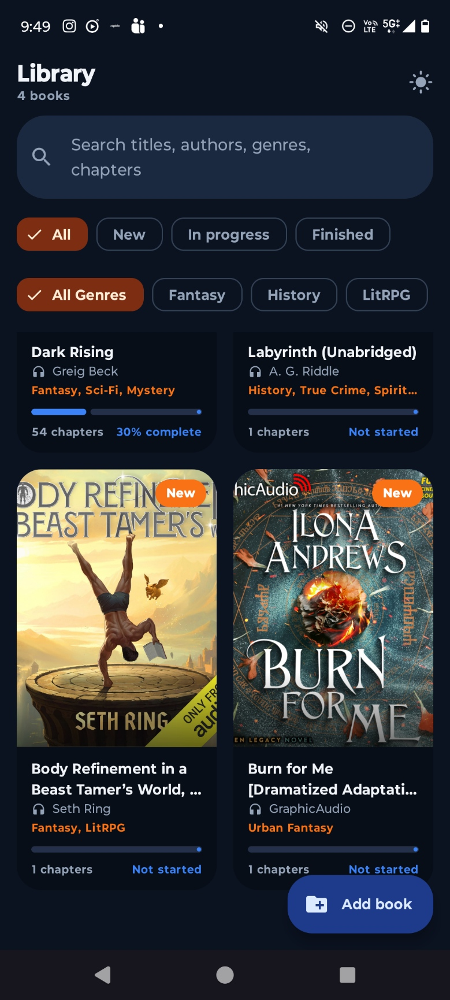
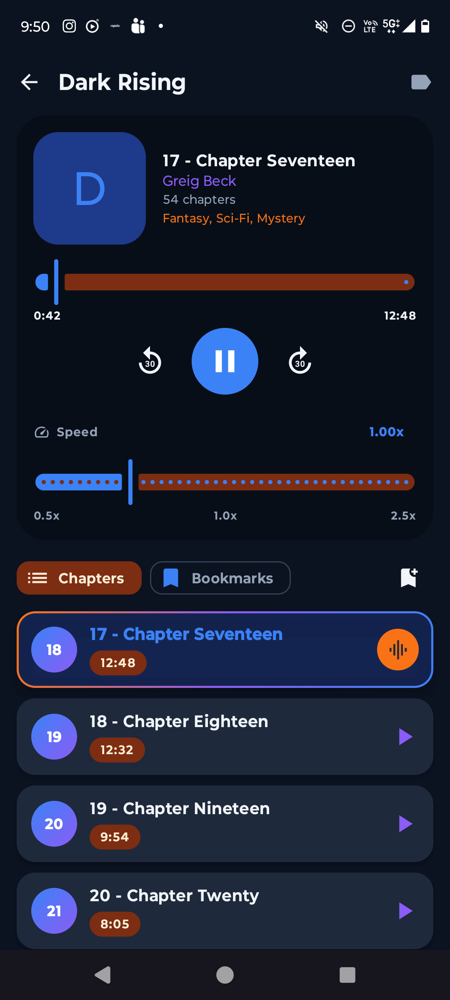
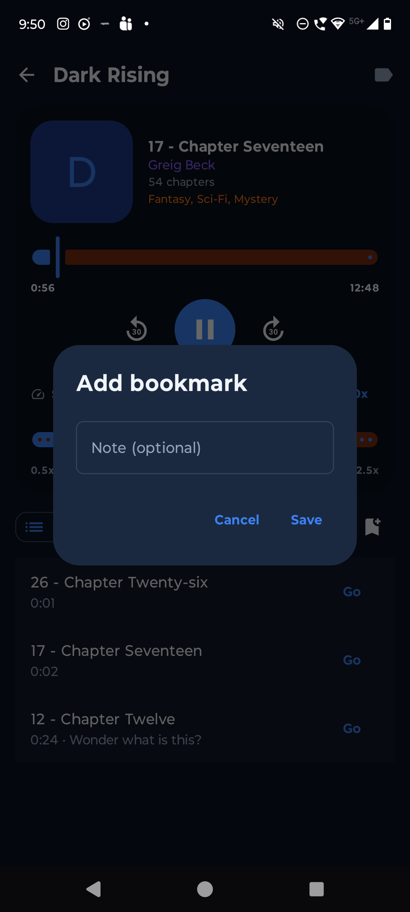
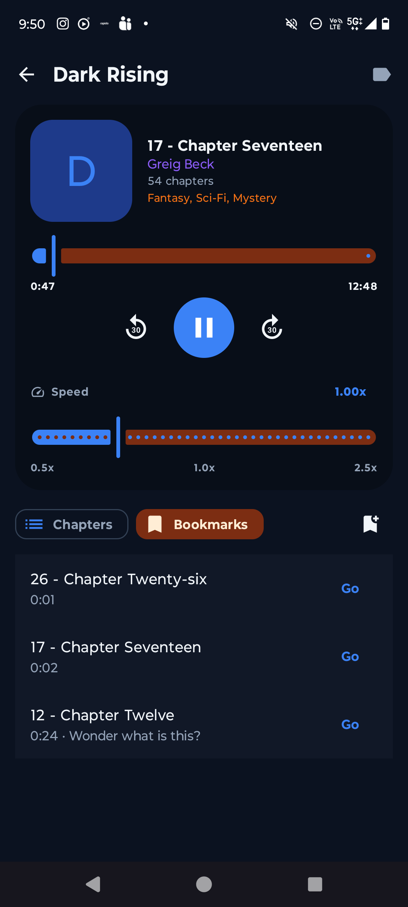

# FoxPlayer

A lightweight Android audiobook player for local audio libraries. Pick a folder on your device—each folder becomes a book, and the audio files inside become chapters.

## Screenshots

### App preview

<div align="center">
  <table>
    <tr>
      <td align="center" width="25%">
        
        <br />
        <strong>Library</strong>
      </td>
      <td align="center" width="25%">
        
        <br />
        <strong>Player</strong>
      </td>
      <td align="center" width="25%">
        
        <br />
        <strong>Bookmarks</strong>
      </td>
      <td align="center" width="25%">
        
        <br />
        <strong>Dark mode</strong>
      </td>
    </tr>
  </table>
</div>

<div align="center">
  <marquee behavior="scroll" direction="left" scrollamount="5" loop="infinite" width="92%">
    
    &nbsp;&nbsp;&nbsp;
    
    &nbsp;&nbsp;&nbsp;
    
    &nbsp;&nbsp;&nbsp;
    
    &nbsp;&nbsp;&nbsp;
    
    &nbsp;&nbsp;&nbsp;
    
  </marquee>
</div>

### Light screenshots

<div align="center">
  <table>
    <tr>
      <td align="center">
        
        <br />
        <strong>Library</strong>
      </td>
      <td align="center">
        
        <br />
        <strong>Player</strong>
      </td>
      <td align="center">
        
        <br />
        <strong>Bookmarks</strong>
      </td>
    </tr>
  </table>
</div>

### Dark mode

<div align="center">
  <table>
    <tr>
      <td align="center">
        
        <br />
        <strong>Dark mode</strong>
      </td>
    </tr>
  </table>
</div>

## Features

- **Folder-based library** — Import audiobooks by selecting a folder. Subfolders are scanned for audio files.
- **Automatic metadata** — Titles, authors, and cover art are read from ID3 tags when available; folder names and image files are used as fallbacks.
- **Chapter playback** — Play, pause, seek, and jump between chapters. Skip back or forward 30 seconds.
- **Playback speed** — Choose from 0.8×, 1.0×, 1.2×, 1.5×, or 2.0×.
- **Bookmarks** — Save your place with optional notes; swipe to delete.
- **Progress tracking** — Resume where you left off. Library cards show per-book completion.
- **Background playback** — Continues playing with a media notification via Media3.
- **Light & dark themes** — Switch themes from the library screen.

## Getting started

1. Tap the folder button on the library screen.
2. Select a folder that contains your audiobook audio files (MP3, M4A, M4B, FLAC, OGG, WAV, and more).
3. Open a book from the grid to start listening.

Long-press a book in the library to remove it from FoxPlayer (files on disk are not deleted).

## Building

Requires Android SDK, JDK 17, and the Android Gradle Plugin (see `build.gradle.kts`).

```bash
# Debug APK
./gradlew assembleDebug

# Release APKs (per-ABI splits; requires signing config)
./gradlew assembleRelease
```

Release builds expect a `keystore.properties` file at the project root. Copy `keystore.properties.example` and fill in your signing details.

Release APKs are written to `app/build/outputs/apk/release/`.

## Tech stack

- Kotlin · Jetpack Compose · Material 3
- Room · Navigation Compose
- Media3 (ExoPlayer) · Coil

## License

AGPL 3.0 License — see [LICENSE](LICENSE).
